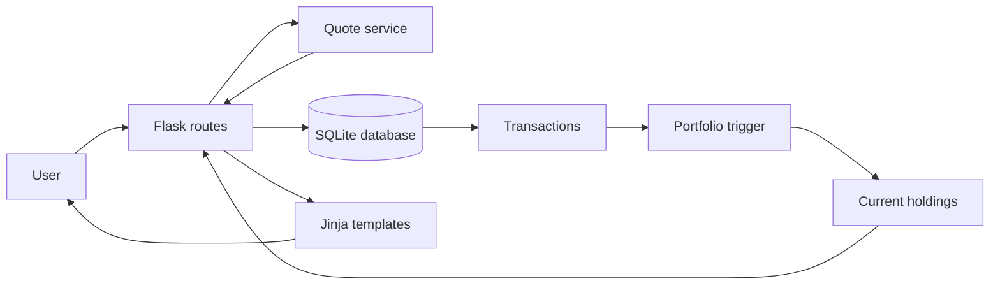

<div align="center">

# 📈 CS50 Finance

### A full-stack stock trading simulator built with Flask and SQLite

[](https://www.python.org/)
[](https://flask.palletsprojects.com/)
[](https://www.sqlite.org/)
[](https://jinja.palletsprojects.com/)

Simulate stock trading with live market quotes, portfolio tracking, secure user accounts, and a complete transaction history.

</div>

---

## ✨ Features

- **Live stock quotes** — look up current market prices by ticker symbol.
- **Portfolio dashboard** — view owned shares, current prices, position values, cash, and total account value.
- **Buy and sell orders** — execute simulated trades with server-side validation.
- **Transaction history** — review every purchase and sale in reverse chronological order.
- **Secure authentication** — register, sign in, sign out, and update passwords using hashed credentials.
- **Reliable accounting** — use atomic SQL transactions to keep cash balances and trade records consistent.
- **Automatic holdings updates** — maintain portfolio positions through a SQLite trigger that converts sales into negative share quantities.

## 🛠️ Tech Stack

| Layer | Technologies |
| --- | --- |
| Backend | Python, Flask, Flask-Session |
| Frontend | HTML, CSS, Bootstrap, Jinja |
| Database | SQLite, SQL, CS50 Library |
| Security | Werkzeug password hashing, session-based authentication |
| Market data | CS50 Finance quote service |

## ⚙️ How It Works



Purchases and sales are recorded inside SQL transactions. After a trade is inserted, the database trigger adds a positive or negative share quantity to the portfolio. Holdings are then aggregated by ticker symbol and combined with live prices to calculate the account's current value.

## 🚀 Getting Started

### Prerequisites

- Python 3.10 or newer
- `pip`
- An internet connection for live quote lookups

### Installation

1. Clone the repository and enter the project directory:

   ```bash
   git clone https://github.com/MottyFeferkorn/Stock-Trading-Web-Application-CS50-Finance.git
   cd Stock-Trading-Web-Application-CS50-Finance
   ```

2. Create and activate a virtual environment:

   ```bash
   python3 -m venv .venv
   source .venv/bin/activate
   ```

   On Windows, use `.venv\Scripts\activate` instead.

3. Install the dependencies:

   ```bash
   pip install -r requirements.txt
   ```

4. Start the development server:

   ```bash
   flask --app app run
   ```

5. Open [http://127.0.0.1:5000](http://127.0.0.1:5000), create an account, and begin trading with the simulated starting balance.

## 📁 Project Structure

```text
.
├── app.py              # Flask routes and trading logic
├── helpers.py          # Quote lookup, formatting, and auth helpers
├── finance.db          # SQLite database
├── requirements.txt    # Python dependencies
├── static/
│   └── styles.css      # Custom styles
└── templates/          # Jinja page templates
    ├── layout.html
    ├── index.html
    ├── buy.html
    ├── sell.html
    ├── quote.html
    ├── history.html
    └── ...
```

## 🗺️ Application Routes

| Route | Purpose |
| --- | --- |
| `/` | Display the user's portfolio and total account value |
| `/quote` | Look up a live stock quote |
| `/buy` | Purchase shares with simulated cash |
| `/sell` | Sell shares currently held in the portfolio |
| `/history` | View the full transaction history |
| `/register` | Create a new account |
| `/login` / `/logout` | Start or end an authenticated session |
| `/account` | Update the account password |

## 🔒 Data Integrity

Trades update multiple pieces of financial state, so buy and sell operations use explicit `BEGIN`, `COMMIT`, and `ROLLBACK` statements. If validation fails—for example, because a user has insufficient cash or shares—the entire operation is rolled back instead of leaving partial data behind.

## 🎓 About the Project

This application is an implementation of **Finance**, a problem set from [CS50's Introduction to Computer Science](https://cs50.harvard.edu/x/). It demonstrates full-stack web development, relational data modeling, authentication, third-party API integration, and transaction-safe application logic.

> This project is intended for education and simulation only. It does not execute real trades or provide financial advice.

---

<div align="center">

Built as part of the CS50 learning journey.

</div>
